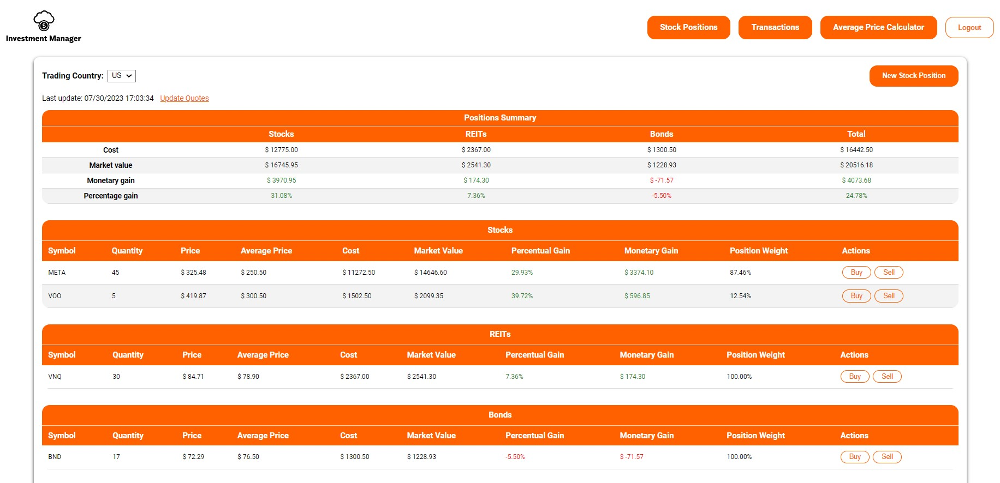
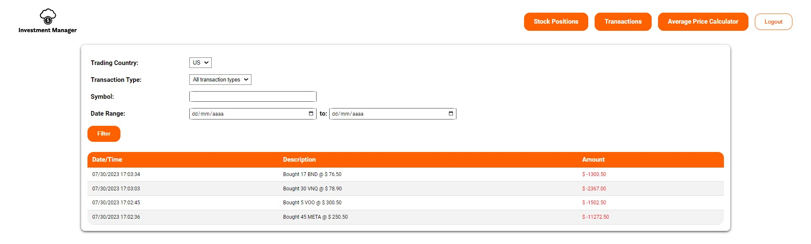

# :chart_with_upwards_trend: investment-manager

## About the project
:bulb: The strategy of investing in different countries results in great diversification for your investments. While this approach offers enhanced risk protection, sometimes is difficult to manage all of your applications, especially if multiple stock brokers are used. \
As a result, this project consists of an application that combines your investments in the United States and Brazil in a single platform. \
The idea was to develop an easy-to-use application to check your position quotes and metrics while enabling to check all of your past transactions.

## :computer: Software Engineer point-of-view
By identifying a way to improve my daily tasks as an investor through the use of technology, I decided to practice my Full Stack Software Engineering skills through the development of this application.\
The client was developed using Vue3 and VueX for state management, and I tried to keep a minimum number of dependencies to practice developing custom reusable components.\
The server was developed using .NET and C#, leveraging Entity Framework Core to manage an MS SQL database. I could practice writing unit/integration tests using xUNIT, and also implementing containerization to run the application.\
The clean-architecture used in the server development enable the easy addition of another countries in the future!\
Since this is a personal project, security measures were not a priority for this project in terms of storing environment variables and database credentials.

## Features

* Register a new stock positions for United States and Brazil as trading countries
* Real time stock quote prices for United States and Brazil stocks
* Edit a position (buy/sell) and automatically updates metrics such as average price, gain/loss and position weight
* Dynamic summary based on trading country and stock types
* List of all transactions performed, which may be filtered by type, date, and symbol
* Average price calculator to simulate transactions






## Technologies

### Client
* Vite
* TypeScript
* Vue 3
* VueX
* Vue Router

### Server
* .NET Core 7.0
* <span>ASP.NET WebApi</span>
* Clean Architecture
* Entity Framework Core - Code First
* Microsoft Sql Server
* Microsoft Identity with JWT Authentication
* In-Memory Caching
* AutoMapper
* xUnit
* Moq
* AutoFixture
* FluentAssertions
* Docker
* Swagger

## Getting Started

## Server

#### Disclaimer
:warning: Since this is a personal project which was developed to practice software engineering skills, all server-sensitive data (e.g., db connection string, jwt token, and third-party API tokens) are stored on appsettings.json. In a real scenario, this information should be stored in a secret environment. For more information, check [here](https://learn.microsoft.com/en-us/aspnet/core/security/app-secrets?view=aspnetcore-7.0)

#### Prerequisites
* Docker
* .NET Core 7.0 SDK (optional)

## :exclamation: Create a Finnhub API Token :exclamation:
1. The server connects to Finnhub API to consume US stock price quotes.  Please register [here](https://finnhub.io/) to get an individual access token.

2. Add the token in the `appsettings.json` (investment-manager/server/src/InvestmentManager.Web/appsettings.json)
```sh
  {
	...
	"FinnhubAccessToken": "my-created-token",
	...
  }
  ```

## :star: Running the server and database using Docker

Both the server application and database can run inside a Docker container following the steps below:

1. Run to following commands from the server folder where the .sln file is located (investment-manager/server)
```sh
  docker-compose build
  docker-compose up
```

This command will create and run two containers:\
a) **sql_server_db** which contains the Microsoft SQL Server database\
b) **investment_manager_web** which contains the .NET application and connects to the database container

2. The application should be running on http://localhost:5000/api

## :star: Running only the database using Docker

The application can be run without Docker, however, still using a container as an Microsoft SQL database following the steps below:

1. Ensure the tool EF is installed
```sh
  dotnet tool update --global dotnet-ef
  ```

2. Open a command prompt in the InvestmentManager.Web folder (investment-manager/server/src/InvestmentManager.Web) and execute the following command:
```sh
  dotnet restore
```

3. Run to following commands from the server folder where the .sln file is located (investment-manager/server)
```sh
  docker-compose build sql_server_db
  docker-compose up sql_server_db
```

This command will create and run a container only for the database.

4. Run the application from the InvestmentManager.Web folder (investment-manager/server/src/InvestmentManager.Web) 
```sh
  dotnet run
```

This command will start the .NET application

5. The application should be running on https://localhost:5252/api
   
## Client

#### Prerequisites
* Node Package Manager (NPM)

## Running the client

1. Install the project dependencies from the client folder (investment-manager/client/) using the following command: 
```sh
  npm install
```

2. Rename the file ***.env.example*** to ***.env*** in the investment-manager/client directory

3. Insert the correct server URL to the property ***VITE_BASE_URL*** according to the address where the server is running.

If the server and the database are running in a Docker container, the URL must be http://localhost:5000/api \
If only the database is running in a Docker container, the URL must be https://localhost:5252/api

4. To run the client, use the following command:
```sh
  npm run dev
```

:warning: Please remember to create and insert a [Finnhub token](https://finnhub.io/) before using the application.


